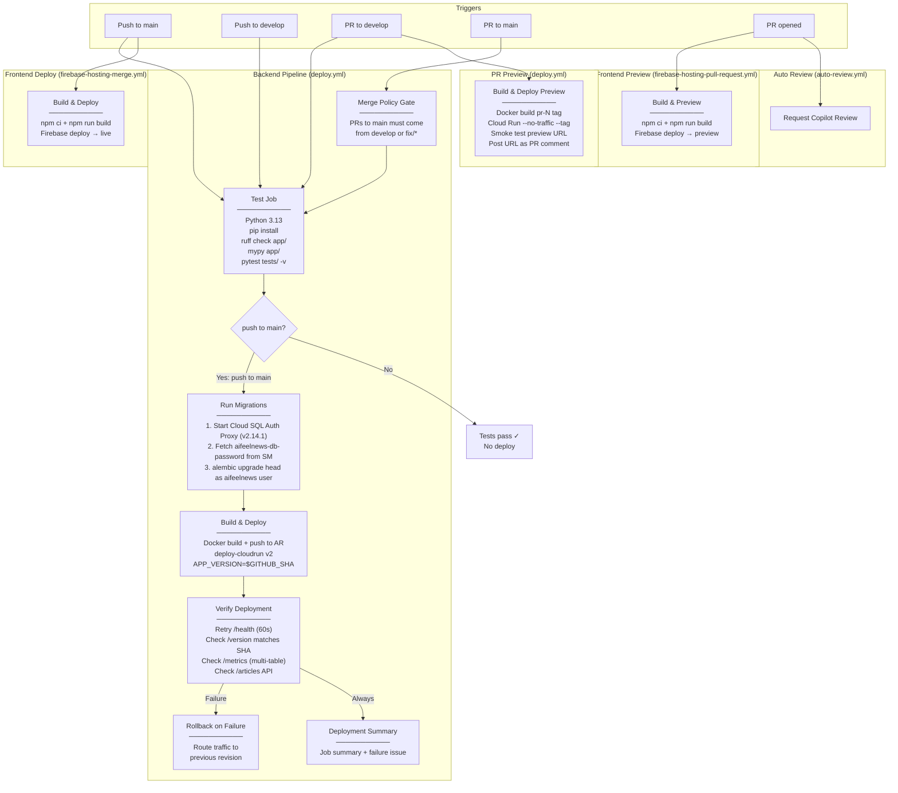

# CI/CD Pipeline Architecture

## Overview

aiFeelNews uses **GitHub Actions** with 6 workflows that automate testing, building, deploying, and security-scanning both backend (Cloud Run) and frontend (Firebase Hosting) components. The pipeline enforces a **Simplified Git Flow** branching strategy with CI-gated merge policies, multi-endpoint smoke tests, automated rollback, and PR preview deploys. CodeQL SAST runs additionally via GitHub Advanced Security default setup (no in-repo workflow file).

## Branching Strategy

```
feature/phase-b-db  ──┐
feature/phase-c-cyber ─┤── PR into: develop (CI tests, NO deploy)
feature/phase-d-auth  ─┘
                           │
                           └── when deploy-ready: PR develop → main (full deploy)

fix/critical-bug  ────────── PR directly to main (hotfix escape hatch)
                              └── after merge: sync main back into develop
```

| Branch | Purpose | Deploys? |
|--------|---------|----------|
| `main` | Production. Merge here = deploy. | Yes — Cloud Run + Firebase |
| `develop` | Integration. Batch feature branches here. | No — tests only |
| `feature/*` | Individual work. PRs target `develop`. | No — tests only |
| `fix/*` | Urgent production hotfixes. PRs target `main`. | Yes — bypasses `develop` |

**CI-enforced merge policy:** PRs from feature branches directly to `main` are blocked by a CI gate. Only `develop` and `fix/*` branches can merge into `main`.

## Pipeline Diagram



## Workflow Details

### 1. Backend: Deploy to Cloud Run (`deploy.yml`)

| Property | Value |
|----------|-------|
| **Trigger** | Push to `main`/`develop` + PR to `main`/`develop` |
| **Merge policy** | CI gate: only `develop` or `fix/*` can PR into `main` |
| **Python** | 3.13 (matches production Dockerfile) |
| **Linting** | `ruff check app/` + `mypy app/` |
| **Tests** | `pytest tests/ -v` with `ENV=test` |
| **Registry** | Artifact Registry (`europe-west1-docker.pkg.dev/aifeelnews-prod/aifeelnews/`) |
| **Migrations** | 3-step in CI (before deploy, not in startup.sh): (1) start Cloud SQL Auth Proxy v2.14.1 on `127.0.0.1:5432`, (2) `gcloud secrets versions access latest --secret=db-password` (postgres superuser, needed for DDL ownership), (3) `alembic upgrade head` as `postgres`. The runtime app on Cloud Run continues to connect as the least-privileged `aifeelnews` user via `secretKeyRef`. |
| **Deploy target** | Cloud Run `aifeelnews-web` in `europe-west1` |
| **Deploy config** | 1Gi, 1 vCPU, min-instances=0, max=10, concurrency=80, timeout=300s |
| **Env vars** | `BIGQUERY_ENABLE_BIGQUERY=true`, `ENV=production`, `APP_VERSION=$GITHUB_SHA`, `SENTIMENT_PROVIDER=GCP_NL`, `GCP_PROJECT_ID` |
| **Secrets** | All mounted from Secret Manager via `secrets:` block: `MEDIASTACK_API_KEY`, `GCP_NLP_KEY_JSON`, `FIREBASE_SERVICE_ACCOUNT_JSON`, `DATABASE_URL` (full Unix-socket conn string ref `aifeelnews-database-url`). Migration password (`aifeelnews-db-password`) pulled in-job via `gcloud`, never written to GitHub. |
| **Service account** | `cloudrun-sa@aifeelnews-prod.iam.gserviceaccount.com` (least-privilege) |
| **Smoke tests** | Multi-endpoint: `/health`, `/version`, `/metrics`, `/articles/` |
| **Rollback** | Automatic on smoke test failure — routes traffic to previous revision |
| **Notifications** | GitHub Environment status, job summary, auto-created issue on failure |
| **Deploy gate** | Only on push to main (PRs + develop run tests only) |

**Job dependency chain:**
```
test (merge policy gate → lint + type-check + unit tests)
  ├── build-and-deploy (only if test passes AND push to main)
  │     ├── Google Auth via credentials_json
  │     ├── Docker build + push to Artifact Registry
  │     ├── Run database migrations:
  │     │     1. Start Cloud SQL Auth Proxy v2.14.1 (127.0.0.1:5432)
  │     │     2. Fetch aifeelnews-db-password from Secret Manager
  │     │     3. alembic upgrade head as aifeelnews user
  │     ├── Deploy to Cloud Run with APP_VERSION
  │     ├── Multi-endpoint smoke test verification
  │     ├── Rollback on failure (route to previous revision)
  │     ├── Deployment summary (GitHub job summary)
  │     └── Create failure issue (if failed)
  │
  └── preview-deploy (only on PR to develop)
        ├── Docker build + push with pr-N tag
        ├── Deploy tagged revision (--no-traffic)
        ├── Smoke test preview URL
        └── Post preview URL as PR comment

preview-cleanup (on PR close)
  └── Remove Cloud Run tag for closed PR
```

### 2. Frontend Deploy (`firebase-hosting-merge.yml`)

| Property | Value |
|----------|-------|
| **Trigger** | Push to `main` |
| **Build** | `npm ci` + `npm run build` in `frontend/` |
| **Deploy** | Firebase Hosting **live** channel |
| **Project** | `aifeelnews-front` |
| **Secrets** | `VITE_FIREBASE_API_KEY`, `VITE_FIREBASE_AUTH_DOMAIN`, `VITE_FIREBASE_PROJECT_ID`, `VITE_FIREBASE_APP_ID` |

### 3. Frontend Preview (`firebase-hosting-pull-request.yml`)

| Property | Value |
|----------|-------|
| **Trigger** | Any PR (from same repo only — security gate) |
| **Build** | Same as merge workflow |
| **Deploy** | Firebase Hosting **preview** channel |
| **Output** | Preview URL posted as PR comment |
| **Permissions** | `checks: write`, `contents: read`, `pull-requests: write` |

### 4. Auto Review (`auto-review.yml`)

| Property | Value |
|----------|-------|
| **Trigger** | PR opened |
| **Action** | Requests GitHub Copilot as reviewer via `github-script` |

### 5. Security Scanning (`security.yml`)

| Property | Value |
|----------|-------|
| **Trigger** | Push/PR to `main` or `develop`, weekly cron (Mon 06:00 UTC), manual dispatch |
| **`pip-audit`** | Scans pinned `requirements.txt` for known CVEs; `--strict` fails CI on any advisory |
| **`gitleaks`** | Full-history secret-leak scan; posts a summary comment on PRs |

### 6. Frontend Type Check (`frontend-check.yml`)

| Property | Value |
|----------|-------|
| **Trigger** | Push/PR to `main` or `develop`, manual dispatch |
| **Action** | Runs `npm run check` (`svelte-check` + `tsc`) |
| **Why** | `vite build` strips TypeScript types without checking them, so type errors never failed the build/preview job. Unlike `firebase-hosting-pull-request.yml`, this workflow has no Dependabot exclusion, so `typescript` / `@types/*` bumps are verified against real type-checking before merge. |

### CodeQL SAST (GitHub default setup)

CodeQL static analysis runs via **GitHub Advanced Security default setup** — configured in repo settings, not as an in-repo workflow file. It scans Python, JavaScript/TypeScript, and GitHub Actions on push/PR, surfacing findings as Code Scanning alerts.

## Secrets Inventory

| Secret | Source | Used By | Purpose |
|--------|--------|---------|---------|
| `GCP_SA_KEY` | GitHub repo secret (production-environment-scoped) | `deploy.yml` | Google Cloud authentication for AR + Cloud Run deploy + Cloud SQL Auth Proxy + Secret Manager reads |
| `db-password` | GCP Secret Manager | (manual / break-glass) | Postgres superuser password — kept for emergency admin access only, no longer used by app or CI |
| `aifeelnews-db-password` **NEW** | GCP Secret Manager | `deploy.yml` (migration step) | Least-privilege `aifeelnews` DB user password. Pulled in-job via `gcloud secrets versions access`; used for `alembic upgrade head` against the Cloud SQL Auth Proxy |
| `aifeelnews-database-url` **NEW** | GCP Secret Manager | `deploy.yml` (Cloud Run runtime) | Full Unix-socket connection string (`postgresql://aifeelnews:...@/aifeelnews?host=/cloudsql/...`). Mounted as `DATABASE_URL` via the deploy-cloudrun `secrets:` block — connection string never lives on the revision spec |
| `mediastack-api-key` | GCP Secret Manager | `deploy.yml` | Mounted as `MEDIASTACK_API_KEY` env var on Cloud Run |
| `aifeelnews-gcp-nlp-key` | GCP Secret Manager | `deploy.yml` | Mounted as `GCP_NLP_KEY_JSON` env var on Cloud Run |
| `firebase-service-account-json` | GCP Secret Manager | `deploy.yml` | Mounted as `FIREBASE_SERVICE_ACCOUNT_JSON` env var on Cloud Run |
| `VITE_FIREBASE_API_KEY` | GitHub repo secret | Frontend workflows | Firebase client config (injected at build time) |
| `VITE_FIREBASE_AUTH_DOMAIN` | GitHub repo secret | Frontend workflows | Firebase auth domain |
| `VITE_FIREBASE_PROJECT_ID` | GitHub repo secret | Frontend workflows | Firebase project identifier |
| `VITE_FIREBASE_APP_ID` | GitHub repo secret | Frontend workflows | Firebase app identifier |
| `FIREBASE_SERVICE_ACCOUNT_AIFEELNEWS_FRONT` | GitHub repo secret | Frontend workflows | Firebase Hosting deploy credentials |
| `GITHUB_TOKEN` | GitHub-provided | Frontend workflows | Auto-provided, used for PR comments |

**DB user model:** The `postgres` superuser is now reserved for emergency admin access only. Both runtime (Cloud Run) and migrations (CI) connect as the least-privilege `aifeelnews` user, with credentials fetched from Secret Manager at job time rather than baked into GitHub secrets or Cloud Run revision specs.

**`github-actions-sa` IAM roles** (granted in `infra/main.tf`):
- `roles/run.admin` — deploy Cloud Run revisions
- `roles/artifactregistry.writer` — push Docker images
- `roles/iam.serviceAccountUser` — act as `cloudrun-sa` during deploy
- `roles/secretmanager.secretAccessor` **NEW** — read DB password during deploy
- `roles/cloudsql.client` **NEW** — run Cloud SQL Auth Proxy in CI
- `roles/serviceusage.serviceUsageConsumer` **NEW** — Cloud Run deploy validation

## Environment Gates

```
Feature branch created from develop
  └── PR to develop
        ├── Backend tests run (merge policy + ruff + mypy + pytest)
        ├── Backend preview deployed (Cloud Run tagged revision, no traffic)
        ├── Frontend preview deployed (Firebase preview channel)
        └── Copilot review requested

Merged to develop (batch features here)
  └── Tests re-run, no deployment

PR develop → main (release)
  └── Tests pass → Migrations → Build → Deploy → Smoke tests → Rollback if failed

Push to main (after merge)
  ├── Backend: test → migrate → build → push → deploy → verify → rollback/notify
  └── Frontend: build → deploy to Firebase Hosting live channel
```

No code reaches production without passing all linting, type checking, and tests. Migrations run before the new image is deployed. Failed deployments automatically roll back to the previous revision.

## Deployment Resilience

| Safeguard | How It Works |
|-----------|-------------|
| **Merge policy** | CI blocks feature branches from merging directly to `main` |
| **Migration safety** | Alembic runs in CI before deploy, not in `startup.sh` — bad migrations don't crash the service |
| **Multi-endpoint smoke tests** | Verifies `/health`, `/version` (SHA match), `/metrics`, and `/articles/` API |
| **Automated rollback** | On smoke test failure, traffic routes back to previous Cloud Run revision |
| **Deployment notifications** | GitHub Environment status + job summary + auto-created issue on failure |
| **PR previews** | Cloud Run tagged revisions with `--no-traffic` — free validation before merging |
| **Hotfix escape hatch** | `fix/*` branches bypass `develop` for urgent production fixes |
