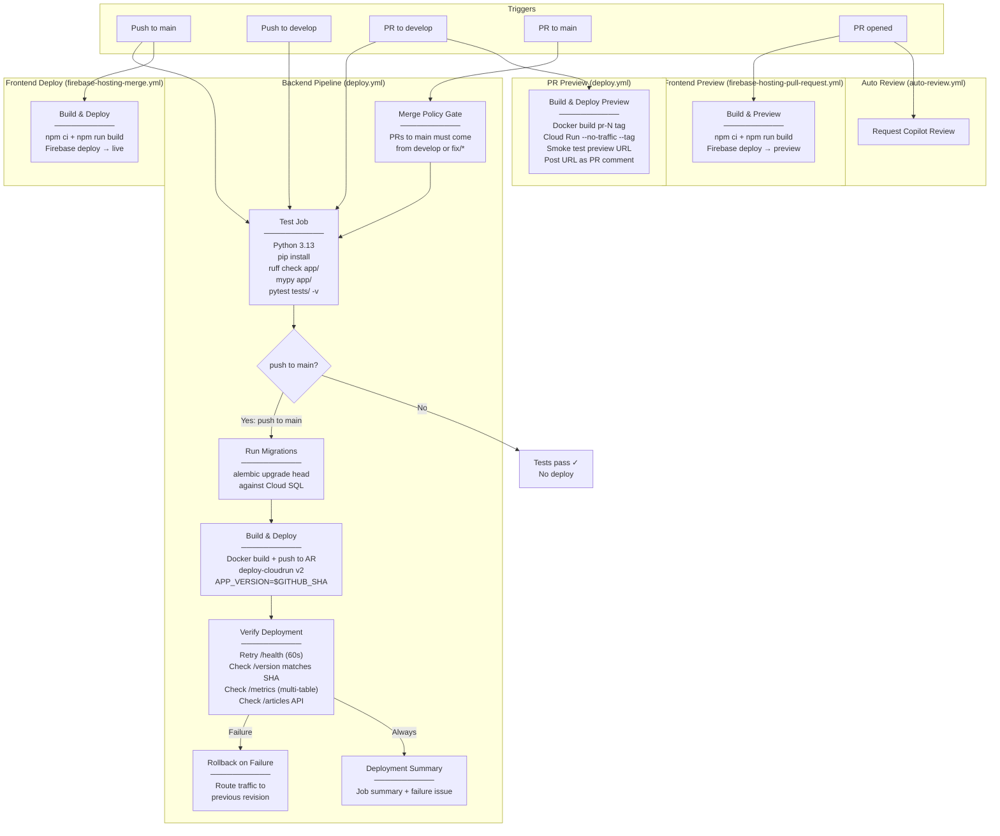

# CI/CD Pipeline Architecture

## Overview

aiFeelNews uses **GitHub Actions** with 4 workflows that automate testing, building, and deploying both backend (Cloud Run) and frontend (Firebase Hosting) components. The pipeline enforces a **Simplified Git Flow** branching strategy with CI-gated merge policies, multi-endpoint smoke tests, automated rollback, and PR preview deploys.

## Branching Strategy

```
feature/phase-b-db  ──┐
feature/phase-c-cyber ─┤── PR into: develop (CI tests, NO deploy)
feature/phase-d-auth  ─┘
                           │
                           └── when deploy-ready: PR develop → main (full deploy)

fix/critical-bug  ────────── PR directly to main (hotfix escape hatch)
                              └── after merge: sync main back into develop
```

| Branch | Purpose | Deploys? |
|--------|---------|----------|
| `main` | Production. Merge here = deploy. | Yes — Cloud Run + Firebase |
| `develop` | Integration. Batch feature branches here. | No — tests only |
| `feature/*` | Individual work. PRs target `develop`. | No — tests only |
| `fix/*` | Urgent production hotfixes. PRs target `main`. | Yes — bypasses `develop` |

**CI-enforced merge policy:** PRs from feature branches directly to `main` are blocked by a CI gate. Only `develop` and `fix/*` branches can merge into `main`.

## Pipeline Diagram



## Workflow Details

### 1. Backend: Deploy to Cloud Run (`deploy.yml`)

| Property | Value |
|----------|-------|
| **Trigger** | Push to `main`/`develop` + PR to `main`/`develop` |
| **Merge policy** | CI gate: only `develop` or `fix/*` can PR into `main` |
| **Python** | 3.13 (matches production Dockerfile) |
| **Linting** | `ruff check app/` + `mypy app/` |
| **Tests** | `pytest tests/ -v` with `ENV=test` |
| **Registry** | Artifact Registry (`europe-west1-docker.pkg.dev/aifeelnews-prod/aifeelnews/`) |
| **Migrations** | `alembic upgrade head` in CI (before deploy, not in startup.sh) |
| **Deploy target** | Cloud Run `aifeelnews-web` in `europe-west1` |
| **Deploy config** | 512Mi, 1 vCPU, min-instances=0, max=10, concurrency=80, timeout=300s |
| **Env vars** | `BIGQUERY_ENABLE_BIGQUERY=true`, `ENV=production`, `APP_VERSION=$GITHUB_SHA` |
| **Secrets** | `MEDIASTACK_API_KEY` from Secret Manager, `MIGRATION_DATABASE_URL` for CI |
| **Service account** | `cloudrun-sa@aifeelnews-prod.iam.gserviceaccount.com` (least-privilege) |
| **Smoke tests** | Multi-endpoint: `/health`, `/version`, `/metrics`, `/articles/` |
| **Rollback** | Automatic on smoke test failure — routes traffic to previous revision |
| **Notifications** | GitHub Environment status, job summary, auto-created issue on failure |
| **Deploy gate** | Only on push to main (PRs + develop run tests only) |

**Job dependency chain:**
```
test (merge policy gate → lint + type-check + unit tests)
  ├── build-and-deploy (only if test passes AND push to main)
  │     ├── Google Auth via credentials_json
  │     ├── Docker build + push to Artifact Registry
  │     ├── Run database migrations (alembic via Cloud SQL)
  │     ├── Deploy to Cloud Run with APP_VERSION
  │     ├── Multi-endpoint smoke test verification
  │     ├── Rollback on failure (route to previous revision)
  │     ├── Deployment summary (GitHub job summary)
  │     └── Create failure issue (if failed)
  │
  └── preview-deploy (only on PR to develop)
        ├── Docker build + push with pr-N tag
        ├── Deploy tagged revision (--no-traffic)
        ├── Smoke test preview URL
        └── Post preview URL as PR comment

preview-cleanup (on PR close)
  └── Remove Cloud Run tag for closed PR
```

### 2. Frontend Deploy (`firebase-hosting-merge.yml`)

| Property | Value |
|----------|-------|
| **Trigger** | Push to `main` |
| **Build** | `npm ci` + `npm run build` in `frontend/` |
| **Deploy** | Firebase Hosting **live** channel |
| **Project** | `aifeelnews-front` |
| **Secrets** | `VITE_FIREBASE_API_KEY`, `VITE_FIREBASE_AUTH_DOMAIN`, `VITE_FIREBASE_PROJECT_ID`, `VITE_FIREBASE_APP_ID` |

### 3. Frontend Preview (`firebase-hosting-pull-request.yml`)

| Property | Value |
|----------|-------|
| **Trigger** | Any PR (from same repo only — security gate) |
| **Build** | Same as merge workflow |
| **Deploy** | Firebase Hosting **preview** channel |
| **Output** | Preview URL posted as PR comment |
| **Permissions** | `checks: write`, `contents: read`, `pull-requests: write` |

### 4. Auto Review (`auto-review.yml`)

| Property | Value |
|----------|-------|
| **Trigger** | PR opened |
| **Action** | Requests GitHub Copilot as reviewer via `github-script` |

## Secrets Inventory

| Secret | Used By | Purpose |
|--------|---------|---------|
| `GCP_SA_KEY` | `deploy.yml` | Google Cloud authentication for AR + Cloud Run + Cloud SQL Proxy |
| `MIGRATION_DATABASE_URL` | `deploy.yml` | Cloud SQL connection for CI-based Alembic migrations |
| `mediastack-api-key` (GCP SM) | `deploy.yml` | Mounted as `MEDIASTACK_API_KEY` env var on Cloud Run |
| `VITE_FIREBASE_API_KEY` | Frontend workflows | Firebase client config (injected at build time) |
| `VITE_FIREBASE_AUTH_DOMAIN` | Frontend workflows | Firebase auth domain |
| `VITE_FIREBASE_PROJECT_ID` | Frontend workflows | Firebase project identifier |
| `VITE_FIREBASE_APP_ID` | Frontend workflows | Firebase app identifier |
| `FIREBASE_SERVICE_ACCOUNT_AIFEELNEWS_FRONT` | Frontend workflows | Firebase Hosting deploy credentials |
| `GITHUB_TOKEN` | Frontend workflows | Auto-provided, used for PR comments |

## Environment Gates

```
Feature branch created from develop
  └── PR to develop
        ├── Backend tests run (merge policy + ruff + mypy + pytest)
        ├── Backend preview deployed (Cloud Run tagged revision, no traffic)
        ├── Frontend preview deployed (Firebase preview channel)
        └── Copilot review requested

Merged to develop (batch features here)
  └── Tests re-run, no deployment

PR develop → main (release)
  └── Tests pass → Migrations → Build → Deploy → Smoke tests → Rollback if failed

Push to main (after merge)
  ├── Backend: test → migrate → build → push → deploy → verify → rollback/notify
  └── Frontend: build → deploy to Firebase Hosting live channel
```

No code reaches production without passing all linting, type checking, and tests. Migrations run before the new image is deployed. Failed deployments automatically roll back to the previous revision.

## Deployment Resilience

| Safeguard | How It Works |
|-----------|-------------|
| **Merge policy** | CI blocks feature branches from merging directly to `main` |
| **Migration safety** | Alembic runs in CI before deploy, not in `startup.sh` — bad migrations don't crash the service |
| **Multi-endpoint smoke tests** | Verifies `/health`, `/version` (SHA match), `/metrics`, and `/articles/` API |
| **Automated rollback** | On smoke test failure, traffic routes back to previous Cloud Run revision |
| **Deployment notifications** | GitHub Environment status + job summary + auto-created issue on failure |
| **PR previews** | Cloud Run tagged revisions with `--no-traffic` — free validation before merging |
| **Hotfix escape hatch** | `fix/*` branches bypass `develop` for urgent production fixes |
