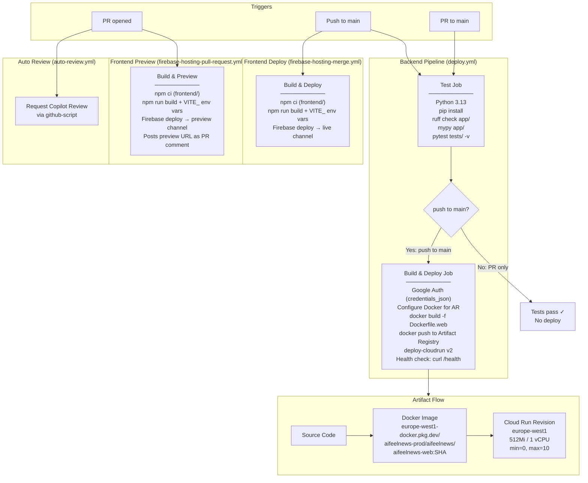

# CI/CD Pipeline Architecture

## Overview

aiFeelNews uses **GitHub Actions** with 4 workflows that automate testing, building, and deploying both backend (Cloud Run) and frontend (Firebase Hosting) components.

## Pipeline Diagram



## Workflow Details

### 1. Backend: Deploy to Cloud Run (`deploy.yml`)

| Property | Value |
|----------|-------|
| **Trigger** | Push to `main` + PR to `main` |
| **Python** | 3.13 (matches production Dockerfile) |
| **Linting** | `ruff check app/` + `mypy app/` |
| **Tests** | `pytest tests/ -v` with `ENV=test` and SQLite |
| **Registry** | Artifact Registry (`europe-west1-docker.pkg.dev/aifeelnews-prod/aifeelnews/`) |
| **Deploy target** | Cloud Run `aifeelnews-web` in `europe-west1` |
| **Deploy config** | 512Mi, 1 vCPU, min-instances=0, max=10, concurrency=80, timeout=300s |
| **Service account** | `cloudrun-sa@aifeelnews-prod.iam.gserviceaccount.com` (least-privilege) |
| **Health check** | `curl /health` after deployment |
| **Deploy gate** | Only on push to main (PRs run tests only) |

**Job dependency chain:**
```
test (lint + type-check + unit tests)
  └── build-and-deploy (only if test passes AND push to main)
        ├── Google Auth via credentials_json
        ├── Docker build + push to Artifact Registry
        ├── Deploy to Cloud Run
        └── Health check verification
```

### 2. Frontend Deploy (`firebase-hosting-merge.yml`)

| Property | Value |
|----------|-------|
| **Trigger** | Push to `main` |
| **Build** | `npm ci` + `npm run build` in `frontend/` |
| **Deploy** | Firebase Hosting **live** channel |
| **Project** | `aifeelnews-front` |
| **Secrets** | `VITE_FIREBASE_API_KEY`, `VITE_FIREBASE_AUTH_DOMAIN`, `VITE_FIREBASE_PROJECT_ID`, `VITE_FIREBASE_APP_ID` |

### 3. Frontend Preview (`firebase-hosting-pull-request.yml`)

| Property | Value |
|----------|-------|
| **Trigger** | Any PR (from same repo only — security gate) |
| **Build** | Same as merge workflow |
| **Deploy** | Firebase Hosting **preview** channel |
| **Output** | Preview URL posted as PR comment |
| **Permissions** | `checks: write`, `contents: read`, `pull-requests: write` |

### 4. Auto Review (`auto-review.yml`)

| Property | Value |
|----------|-------|
| **Trigger** | PR opened |
| **Action** | Requests GitHub Copilot as reviewer via `github-script` |

## Secrets Inventory

| Secret | Used By | Purpose |
|--------|---------|---------|
| `GCP_SA_KEY` | `deploy.yml` | Google Cloud authentication for Artifact Registry + Cloud Run |
| `VITE_FIREBASE_API_KEY` | Frontend workflows | Firebase client config (injected at build time) |
| `VITE_FIREBASE_AUTH_DOMAIN` | Frontend workflows | Firebase auth domain |
| `VITE_FIREBASE_PROJECT_ID` | Frontend workflows | Firebase project identifier |
| `VITE_FIREBASE_APP_ID` | Frontend workflows | Firebase app identifier |
| `FIREBASE_SERVICE_ACCOUNT_AIFEELNEWS_FRONT` | Frontend workflows | Firebase Hosting deploy credentials |
| `GITHUB_TOKEN` | Frontend workflows | Auto-provided, used for PR comments |

## Environment Gates

```
PR created
  ├── Backend tests run (ruff + mypy + pytest)
  ├── Frontend preview deployed (preview URL in PR comment)
  └── Copilot review requested

PR merged to main
  ├── Backend: tests → build Docker → push to AR → deploy to Cloud Run → health check
  └── Frontend: build → deploy to Firebase Hosting live channel
```

No code reaches production without passing all linting, type checking, and tests first.
