# Entity-Relationship Diagram — aiFeelNews

## Overview

The aiFeelNews database consists of **10 tables** in PostgreSQL 14, managed via SQLAlchemy 2.0 ORM with Alembic migrations. The schema supports news article ingestion, NLP-based sentiment analysis, entity extraction, category classification, and user bookmarking.

**Data volume:** ~50–200 articles/day ingested every 8 hours via Cloud Scheduler from the Mediastack API.

## ER Diagram

```mermaid
erDiagram
    sources {
        int id PK
        varchar_255 name UK "idx_sources_name"
        timestamptz created_at "idx_sources_created_at"
        timestamptz updated_at "idx_sources_updated_at"
    }

    users {
        int id PK
        varchar_255 email UK "idx_users_email"
        varchar hashed_password "nullable"
        varchar firebase_uid UK "idx_users_firebase_uid, nullable"
    }

    articles {
        int id PK
        int source_id FK "-> sources.id, ON DELETE CASCADE"
        varchar_255 title
        varchar_1000 description "nullable"
        varchar_1000 url UK
        varchar_1000 image_url "nullable"
        timestamptz published_at "idx_articles_published_at"
        varchar_2 language "nullable"
        varchar_2 country "nullable"
        varchar_50 category "nullable"
        varchar_20 sentiment_label "nullable, denormalized"
        float sentiment_score "nullable, denormalized"
        float sentiment_magnitude "nullable, denormalized, GCP NL only"
    }

    bookmarks {
        int id PK
        int user_id FK "-> users.id, ON DELETE CASCADE"
        int article_id FK "-> articles.id, ON DELETE CASCADE"
    }

    article_contents {
        int id PK
        int article_id FK "-> articles.id, ON DELETE CASCADE, UNIQUE"
        text content_text "max 1024 chars, truncated"
        varchar_64 content_hash "idx, SHA-256 dedup"
        int content_length "original length before truncation"
        timestamptz extracted_at "idx_article_contents_extracted_at"
        timestamptz expires_at "idx_article_contents_expires_at, TTL"
    }

    sentiment_analyses {
        int id PK
        int article_id FK "-> articles.id, ON DELETE CASCADE"
        varchar_50 provider "idx, e.g. GCP_NL / VADER"
        varchar_100 model_name "nullable"
        float score "range: -1.0 to 1.0"
        float magnitude "nullable, GCP NL only"
        varchar_20 label "idx, positive/negative/neutral"
        varchar_10 language "nullable"
        timestamptz analyzed_at "idx_sentiment_analyses_analyzed_at"
    }

    crawl_jobs {
        int id PK
        int article_id FK "-> articles.id, ON DELETE CASCADE"
        enum status "idx, PENDING/IN_PROGRESS/SUCCESS/FAILED/FORBIDDEN/RATE_LIMITED"
        bool robots_allowed "nullable"
        int http_status "nullable"
        timestamptz fetched_at "nullable"
        int bytes_downloaded "nullable"
        varchar_50 error_code "nullable"
        text error_message "nullable"
        timestamptz created_at "idx_crawl_jobs_created_at"
        timestamptz updated_at
    }

    entities {
        int id PK
        varchar_255 name "idx_entities_name"
        varchar_50 type "idx_entities_type"
        varchar_1000 wikipedia_url "nullable"
        varchar_100 mid "nullable, Google Knowledge Graph"
        timestamptz created_at
    }

    article_entities {
        int id PK
        int article_id FK "-> articles.id, ON DELETE CASCADE"
        int entity_id FK "-> entities.id, ON DELETE CASCADE"
        float salience "0.0-1.0 relevance score"
        int mention_count "default 1"
        timestamptz analyzed_at
    }

    article_categories {
        int id PK
        int article_id FK "-> articles.id, ON DELETE CASCADE"
        varchar_500 name "idx, taxonomy path e.g. /News/Business"
        float confidence "0.0-1.0"
        timestamptz analyzed_at
    }

    %% --- Relationships ---

    sources ||--o{ articles : "has many"
    articles ||--o| article_contents : "has one (optional)"
    articles ||--o{ sentiment_analyses : "analyzed by many providers"
    articles ||--o{ crawl_jobs : "tracked by crawl attempts"
    articles ||--o{ article_entities : "mentions many entities"
    articles ||--o{ article_categories : "classified into categories"
    articles ||--o{ bookmarks : "bookmarked by users"
    users ||--o{ bookmarks : "bookmarks articles"
    entities ||--o{ article_entities : "mentioned in many articles"
```



## Relationship Summary

| Relationship | Type | Join Table | Notes |
|-------------|------|------------|-------|
| sources -> articles | 1:N | -- | Each article belongs to one source |
| articles -> article_contents | 1:1 | -- | Crawled body text, truncated to 1024 chars with TTL expiry |
| articles -> sentiment_analyses | 1:N | -- | Multi-provider: GCP NL (primary) + VADER (fallback) |
| articles -> crawl_jobs | 1:N | -- | Tracks crawl attempts, respects robots.txt |
| users <-> articles | **M:N** | `bookmarks` | Pure join table -- user bookmarks |
| articles <-> entities | **M:N** | `article_entities` | Rich join table with `salience`, `mention_count`, `analyzed_at` |
| articles -> article_categories | 1:N | -- | Per-article NLP classification (not a canonical vocabulary) |

## M2M Relationships -- Design Decisions

### bookmarks (users <-> articles)
A classic **many-to-many** association: any user can bookmark any article, and an article can be bookmarked by multiple users. The `bookmarks` table is a pure join table with no extra attributes beyond the foreign keys.

### article_entities (articles <-> entities)
A **many-to-many with payload**: articles mention multiple entities, and entities appear across multiple articles. The join table carries additional NLP metadata:
- `salience` (0.0-1.0) -- how relevant the entity is to the article
- `mention_count` -- how many times the entity appears in the text
- `analyzed_at` -- when the NLP analysis was performed

The `entities` table is a **canonical lookup** with a unique constraint on `(name, type)`, ensuring deduplication across articles. For example, "Google" + "ORGANIZATION" is stored once and referenced by many `article_entities` rows.

### article_categories -- Why NOT M2M?
Categories are **per-article NLP output**, not a shared vocabulary. Each article receives its own classification with a confidence score from Google Cloud NL API. There is intentionally no `categories` master table because:
1. The taxonomy paths (e.g., `/News/Business`, `/Sports/Soccer`) come directly from the NLP API and are not curated
2. Confidence scores are article-specific -- the same category path may have different confidence for different articles
3. A canonical vocabulary would add complexity without benefit since categories are not user-facing entities that need deduplication

## Composite & Performance Indexes

| Table | Index | Columns | Type | Purpose |
|-------|-------|---------|------|---------|
| `entities` | `ix_entities_name_type` | (name, type) | UNIQUE | Canonical deduplication |
| `article_entities` | `ix_article_entities_article_entity` | (article_id, entity_id) | UNIQUE | Prevent duplicate mentions |
| `sentiment_analyses` | `ix_sentiment_analyses_provider_article` | (provider, article_id) | COMPOSITE | Multi-provider lookups |
| `articles` | `ix_articles_published_at` | (published_at) | B-TREE | Timeline/feed ordering |
| `articles` | `ix_articles_sentiment_label` | (sentiment_label) | B-TREE | Filter feed by sentiment |
| `articles` | `ix_articles_category` | (category) | B-TREE | Filter feed by category |
| `articles` | `ix_articles_source_id` | (source_id) | B-TREE | Filter feed by source + FK join cover |
| `article_contents` | `ix_article_contents_expires_at` | (expires_at) | B-TREE | TTL cleanup job efficiency |
| `crawl_jobs` | `ix_crawl_jobs_status` | (status) | B-TREE | Job queue filtering |

## Cascade Delete Strategy

All child tables use `ON DELETE CASCADE` from their parent FK, ensuring referential integrity when articles or sources are removed:

```
sources (delete) -> articles (cascade) -> bookmarks, article_contents,
                                          sentiment_analyses, crawl_jobs,
                                          article_entities, article_categories
                                          (all cascade)

users (delete) -> bookmarks (cascade)

entities (delete) -> article_entities (cascade)
```

## Data Lifecycle

1. **Ingestion** -- Cloud Scheduler triggers `POST /trigger-ingestion` every 8 hours
2. **Normalize** -- Mediastack response parsed; articles deduplicated by URL; source created/linked
3. **Crawl** -- Original article URL fetched (robots.txt checked first); body truncated to 1024 chars
4. **NLP Analysis** -- GCP Cloud NL `annotateText` extracts sentiment, entities, and categories
5. **Storage** -- Results persisted to PostgreSQL (article_contents, sentiment_analyses, article_entities, article_categories)
6. **BigQuery Streaming** -- Sentiment events streamed to BigQuery for long-term analytics
7. **TTL Cleanup** -- `article_contents` rows past `expires_at` are deleted to enforce data minimization
