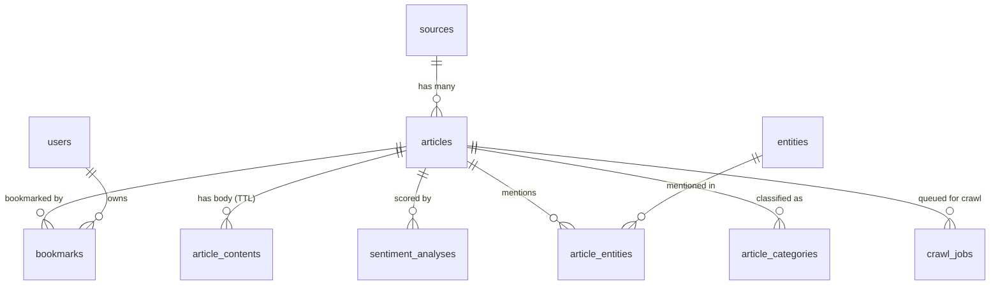

# Relational Databases Submission — aiFeelNews

**Module:** SE_05 — Relational Databases
**Author:** Matias Cardone
**Submission date:** 2026-05-04

---

## How to view this submission's exact state

This document corresponds to git tag `submission-rel-db-2026-05-04` and branch `submission-2026-05-04` on the project repository. The live URL `https://aifeelnews-front.web.app/` reflects the same state at submission time but may evolve as the project continues toward the Capstone assessment in 2-3 weeks.

**File links in this document point to the frozen `submission-2026-05-04` branch**, not to `main`. That way the source they reference doesn't drift if the project keeps moving after submission.

| Pointer | Where |
|---|---|
| Repository | https://github.com/cardox6/aifeelnews/tree/submission-2026-05-04 |
| Tag | `submission-rel-db-2026-05-04` |
| Live frontend | https://aifeelnews-front.web.app/ |
| Live API | https://aifeelnews-web-813770885946.europe-west1.run.app |
| Module deliverables index | This document |

---

## 1. Project identity

aiFeelNews is a news sentiment analysis platform: it ingests articles from Mediastack, crawls original content (respecting robots.txt), runs sentiment analysis via Google Cloud Natural Language API (with VADER as a local fallback), and presents articles with sentiment indicators in a Svelte SPA. The data layer is PostgreSQL 14 accessed through SQLAlchemy 2.0's typed `Mapped[]` ORM and managed with Alembic.

The repository is **public** at https://github.com/cardox6/aifeelnews — no invitation needed.

**Team contribution:** solo project. All commits on the `submission-2026-05-04` branch are mine.

---

## 2. Use cases

22 use cases mapped to 4 personas, in [docs/PERSONAS_AND_USE_CASES.md](https://github.com/cardox6/aifeelnews/blob/submission-2026-05-04/docs/PERSONAS_AND_USE_CASES.md).

| Persona | Backend ✅ | UI ✅ | UI 🔲 | UI n/a | Backend 🔲 |
|---------|-----------|------|------|--------|-----------|
| P1 Casual Reader | 7 / 7 | 6 / 7 | 1 (UC-02) | 0 | 0 |
| P2 Registered Reader | 4 / 5 | 4 / 5 | 0 | 0 | 1 (UC-09) |
| P3 News Analyst | 7 / 7 | 4 / 7 | 3 (UC-16, UC-18, UC-19) | 0 | 0 |
| P4 System Administrator | 3 / 3 | n/a | n/a | 3 | 0 |
| **Totals** | **21 / 22** | **14 / 19 user-facing** | **5** | **3** | **1** |

The two-column status (Backend / UI) reflects that backend implementation and frontend wiring move on different timelines. The Analytics tab on the live SPA exposes four charts (sentiment trends, source comparison, top entities, GCP NL categories) covering UC-13/14/15/17. Entity-sentiment distribution (UC-16) and the entity directory pages (UC-18/19) are backend-only for now.

Each table in the schema serves at least one real use case; the [Tables → Use Cases traceability matrix](https://github.com/cardox6/aifeelnews/blob/submission-2026-05-04/docs/PERSONAS_AND_USE_CASES.md#tables--use-cases-db-centric-view) makes this explicit.

---

## 3. Repository layout and dev setup

[README.md § Development Setup](https://github.com/cardox6/aifeelnews/blob/submission-2026-05-04/README.md#development-setup) covers the supported local path. The short version:

```bash
git clone https://github.com/cardox6/aifeelnews.git
cd aifeelnews
git checkout submission-2026-05-04
cp .env.example .env
docker-compose up --build
docker-compose exec web python -m app.seeds.seed_db
```

This brings up Postgres 14, the FastAPI service, the crawl worker, and the scheduler. The 50-article seed dataset lives at [`app/seeds/seed_data.json`](https://github.com/cardox6/aifeelnews/blob/submission-2026-05-04/app/seeds/seed_data.json) — sampled from production with PII removed, idempotent loader, no Mediastack key required for the demo.

The frontend (Svelte 5 + Vite) runs separately with `cd frontend && npm run dev`.

---

## 4. ER model

The full ER diagram with all 10 tables, M2M relationships, cascade rules, and indexes is in [docs/ER_Diagram.md](https://github.com/cardox6/aifeelnews/blob/submission-2026-05-04/docs/ER_Diagram.md). The Mermaid source renders directly on GitHub.



Two M2M relationships:

- `bookmarks` joins `users` and `articles` with a unique `(user_id, article_id)` constraint enforced at three layers: SQLAlchemy ORM, the migration (`UniqueConstraint`), and a Postgres trigger ([prevent_duplicate_bookmarks](https://github.com/cardox6/aifeelnews/blob/submission-2026-05-04/alembic/versions/e1f2a3b4c5d6_add_db_objects_views_functions_triggers.py)) so even direct SQL inserts cannot create duplicates.
- `article_entities` joins `articles` and `entities` with payload columns (`salience`, `mention_count`, `analyzed_at`) — a true M2M-with-attributes that powers the entity-momentum analytics.

---

## 5. Schema non-triviality

Beyond the M2M relationships above:

- **10 tables**: `sources`, `articles`, `users`, `bookmarks`, `article_contents`, `sentiment_analyses`, `entities`, `article_entities`, `article_categories`, `crawl_jobs`. Inventory and column-by-column listing in [ER_Diagram.md](https://github.com/cardox6/aifeelnews/blob/submission-2026-05-04/docs/ER_Diagram.md).
- **4 PostgreSQL views**: `v_article_summary`, `v_source_stats`, `v_daily_sentiment`, `v_trending_entities` — defined in [migration e1f2a3b4c5d6](https://github.com/cardox6/aifeelnews/blob/submission-2026-05-04/alembic/versions/e1f2a3b4c5d6_add_db_objects_views_functions_triggers.py).
- **2 stored functions** (PL/pgSQL): `fn_sentiment_distribution(days INT)` and `fn_source_performance(days INT)` — same migration.
- **2 triggers**: `trg_update_source_timestamp` (auto-updates `sources.updated_at` on any related article insert) and `trg_prevent_duplicate_bookmarks` (raises before insert if the `(user_id, article_id)` pair already exists).
- **Cascade deletes** on every child FK so removing an article reaps its content, sentiment, entities, and bookmarks atomically — see [ER_Diagram.md § Cascade Delete Strategy](https://github.com/cardox6/aifeelnews/blob/submission-2026-05-04/docs/ER_Diagram.md#cascade-delete-strategy).
- **TTL data lifecycle** on `article_contents.expires_at` with an indexed cleanup job — original article body is truncated to 1024 chars and expires after 7 days, satisfying the data-minimization principle from the cybersecurity threat model.

Full inventory of database objects: [DATABASE.md § 3](https://github.com/cardox6/aifeelnews/blob/submission-2026-05-04/docs/DATABASE.md#3-database-objects).

---

## 6. Data layer — proof it's a real, working database

These three files are the entry points to inspect:

- [app/routers/articles.py](https://github.com/cardox6/aifeelnews/blob/submission-2026-05-04/app/routers/articles.py) — the article list endpoint with composable filters (sentiment, category, source, search) and pagination, served by a single shared `_query_articles` helper. Eager-loads via `joinedload` + `subqueryload` to fix the N+1 that originally hit on every `/articles/` request.
- [app/crud/analytics.py](https://github.com/cardox6/aifeelnews/blob/submission-2026-05-04/app/crud/analytics.py) — five non-trivial SQL patterns:
  - `sentiment_rolling_average` — window function (`AVG() OVER (ORDER BY day ROWS BETWEEN N PRECEDING AND CURRENT ROW)`)
  - `source_sentiment_ranked` — window function (`RANK() OVER (ORDER BY avg_sentiment DESC)`)
  - `sentiment_grouping_sets` — `GROUPING SETS` for multi-dimensional aggregation in one pass
  - `entity_momentum` — two CTEs + `FULL OUTER JOIN` for period-over-period growth
  - `daily_category_sentiment_pivot` — `FILTER (WHERE ...)` clause for conditional aggregates
- [app/routers/db_analytics.py](https://github.com/cardox6/aifeelnews/blob/submission-2026-05-04/app/routers/db_analytics.py) — the live API surface that exposes those queries. Endpoints under `/api/v1/db-analytics/`.

Live URLs the assessor can hit (against the production `submission-2026-05-04`-tagged deployment):

```bash
# Filter + paginate (P1 use cases UC-03 to UC-07)
curl 'https://aifeelnews-web-813770885946.europe-west1.run.app/articles/?sentiment_label=positive&limit=3'
curl 'https://aifeelnews-web-813770885946.europe-west1.run.app/articles/?search=news&limit=3'

# Window function — 7-day rolling sentiment
curl 'https://aifeelnews-web-813770885946.europe-west1.run.app/api/v1/db-analytics/sentiment/rolling?days=14'

# Window function — sources ranked by sentiment
curl 'https://aifeelnews-web-813770885946.europe-west1.run.app/api/v1/db-analytics/sources/ranked?days=30'

# GROUPING SETS — sentiment x category breakdown with subtotals
curl 'https://aifeelnews-web-813770885946.europe-west1.run.app/api/v1/db-analytics/sentiment/breakdown?days=30'
```

---

## 7. Data — production volume and seeding

Live counts pulled from `GET /metrics` on 2026-05-03 21:51 UTC:

| Source | Volume | Where |
|--------|--------|-------|
| Production Postgres | 29,812 articles across 22 sources; 7,483 sentiment-analysed; 539 crawl jobs processed | Cloud SQL `aifeelnews-db` (live: [`/metrics`](https://aifeelnews-web-813770885946.europe-west1.run.app/metrics)) |
| Seed dataset | 50 articles across 10 sources, sampled from production with PII removed | [app/seeds/seed_data.json](https://github.com/cardox6/aifeelnews/blob/submission-2026-05-04/app/seeds/seed_data.json) |
| Test fixture | Synthetic — 10 articles, 2 sources, deterministic | [tests/test_articles_filters.py](https://github.com/cardox6/aifeelnews/blob/submission-2026-05-04/tests/test_articles_filters.py) |

**Generation methods:**
- Production data is ingested every 8 hours by Cloud Scheduler hitting Mediastack (`infra/main.tf` — `ingestion_schedule = "0 */8 * * *"`), normalised, sentiment-scored, and persisted by [`app/jobs/run_ingestion.py`](https://github.com/cardox6/aifeelnews/blob/submission-2026-05-04/app/jobs/run_ingestion.py). A daily cleanup job (2 AM UTC) trims expired article bodies.
- The seed dataset was generated by [`app/seeds/_export_seed.py`](https://github.com/cardox6/aifeelnews/blob/submission-2026-05-04/app/seeds/_export_seed.py) — a one-shot script that pulled a representative sample from prod with all user-identifiable fields stripped.
- The test fixture is built inline in the test module so the assertions stay deterministic even as the schema evolves.

Both seed and fixture flows are idempotent. `python -m app.seeds.seed_db` skips existing URLs; `--reset` truncates seed rows then reinserts.

---

## 8. Where to find each module-description requirement

Pointers into the codebase for the items the module description asks for. I'm leaving the level judgement to the assessor.

### Working data layer with use cases mapped

SQLAlchemy 2.0 ORM with typed `Mapped[]` declarations under [app/models/](https://github.com/cardox6/aifeelnews/tree/submission-2026-05-04/app/models). FastAPI routers in [app/routers/](https://github.com/cardox6/aifeelnews/tree/submission-2026-05-04/app/routers). Alembic migrations under version control in [alembic/versions/](https://github.com/cardox6/aifeelnews/tree/submission-2026-05-04/alembic/versions). 22 use cases mapped to tables in [PERSONAS_AND_USE_CASES.md](https://github.com/cardox6/aifeelnews/blob/submission-2026-05-04/docs/PERSONAS_AND_USE_CASES.md).

### Indexes and query optimization

- `(published_at)` for timeline ordering on every `/articles/` request — added in the initial migration
- `(sentiment_label)`, `(category)`, `(source_id)` added in migration [`f2a3b4c5d6e7`](https://github.com/cardox6/aifeelnews/blob/submission-2026-05-04/alembic/versions/f2a3b4c5d6e7_add_article_filter_indexes.py) so filter+order is index-supported instead of a sequential scan
- `(article_id, entity_id)` UNIQUE on `article_entities` preventing duplicate mentions and accelerating M2M lookups
- `(name, type)` UNIQUE on `entities` for canonical entity deduplication
- `(expires_at)` on `article_contents` so the TTL cleanup job's `WHERE expires_at < now()` doesn't scan every row
- Bookmark FK indexes on `(user_id)` and `(article_id)` — Postgres does not auto-index FKs

Two N+1 fixes are documented in [DATABASE.md § 4.1](https://github.com/cardox6/aifeelnews/blob/submission-2026-05-04/docs/DATABASE.md#41-n1-query-fixes): one on `GET /articles/` (eager-load strategy chosen per relationship — `joinedload` for 1:1, `subqueryload` for high-cardinality M2Ms), and one on `GET /sources/` (an unbounded relationship was being declared in the Pydantic response schema and lazy-loading the entire articles table; the fix was to drop the field from `SourceRead`).

Substring search on `articles.title` uses `ILIKE '%term%'`, which a B-tree cannot accelerate. The pg_trgm GIN upgrade path is documented in [DATABASE.md § 4.4](https://github.com/cardox6/aifeelnews/blob/submission-2026-05-04/docs/DATABASE.md#44-article-filter-indexes).

### Advanced SQL patterns

[app/crud/analytics.py](https://github.com/cardox6/aifeelnews/blob/submission-2026-05-04/app/crud/analytics.py) uses window functions (rolling averages, RANK), CTEs with FULL OUTER JOIN for period-over-period comparisons, GROUPING SETS for multi-dimensional aggregation, and FILTER clauses for conditional aggregates. Each is a single round-trip that returns chart-ready rows; none of them post-process in Python. See § 6 above for the function-by-function breakdown.

### Database objects (views, functions, triggers)

Defined in migration [e1f2a3b4c5d6](https://github.com/cardox6/aifeelnews/blob/submission-2026-05-04/alembic/versions/e1f2a3b4c5d6_add_db_objects_views_functions_triggers.py): 4 views, 2 PL/pgSQL functions, 2 triggers. See § 5 of this document.

### Transactions and ACID

[DATABASE.md § 4A](https://github.com/cardox6/aifeelnews/blob/submission-2026-05-04/docs/DATABASE.md#4a-transactions-and-acid): SQLAlchemy session-per-request scoping, explicit atomicity policies per component (atomic for ingestion batches, per-article for crawl results), and rollback hygiene on the worker path.

### Data lifecycle, backup and recovery

- Lifecycle (TTL, retention, cascade rules, BigQuery export): [DATABASE.md § 5](https://github.com/cardox6/aifeelnews/blob/submission-2026-05-04/docs/DATABASE.md#5-data-lifecycle)
- Cloud SQL automated backups + 7-day PITR: [DATABASE.md § 6](https://github.com/cardox6/aifeelnews/blob/submission-2026-05-04/docs/DATABASE.md#6-backup--recovery)

---

## 9. Test coverage

51 tests passing as of submission. Categories:

- [tests/test_articles_filters.py](https://github.com/cardox6/aifeelnews/blob/submission-2026-05-04/tests/test_articles_filters.py) — 11 tests covering filter, search, pagination, and Pydantic 422 boundary cases on `/articles/`.
- [tests/test_auth_security.py](https://github.com/cardox6/aifeelnews/blob/submission-2026-05-04/tests/test_auth_security.py) — auth, OIDC, CORS, rate-limit assertions.
- [tests/test_new_models.py](https://github.com/cardox6/aifeelnews/blob/submission-2026-05-04/tests/test_new_models.py) — model-level cascade and relationship checks.
- [tests/test_seed_db.py](https://github.com/cardox6/aifeelnews/blob/submission-2026-05-04/tests/test_seed_db.py) — seed loader idempotence.
- [tests/test_crawl_worker.py](https://github.com/cardox6/aifeelnews/blob/submission-2026-05-04/tests/test_crawl_worker.py), [tests/test_ingestion.py](https://github.com/cardox6/aifeelnews/blob/submission-2026-05-04/tests/test_ingestion.py), [tests/test_bigquery.py](https://github.com/cardox6/aifeelnews/blob/submission-2026-05-04/tests/test_bigquery.py) — pipeline coverage.

Run inside the Compose stack: `docker-compose exec web pytest -v`.

---

## 10. Documentation index

| Document | Purpose |
|----------|---------|
| [DATABASE.md](https://github.com/cardox6/aifeelnews/blob/submission-2026-05-04/docs/DATABASE.md) | Setup, migrations, schema objects, optimisation patterns, transactions, data lifecycle, backup/recovery, testing |
| [ER_Diagram.md](https://github.com/cardox6/aifeelnews/blob/submission-2026-05-04/docs/ER_Diagram.md) | Mermaid ER, table-by-table column listing, cardinality, full index map |
| [PERSONAS_AND_USE_CASES.md](https://github.com/cardox6/aifeelnews/blob/submission-2026-05-04/docs/PERSONAS_AND_USE_CASES.md) | Personas, 22 use cases with Backend/UI status, traceability matrix |
| [README.md](https://github.com/cardox6/aifeelnews/blob/submission-2026-05-04/README.md) | Project overview, dev setup, API endpoint inventory |
